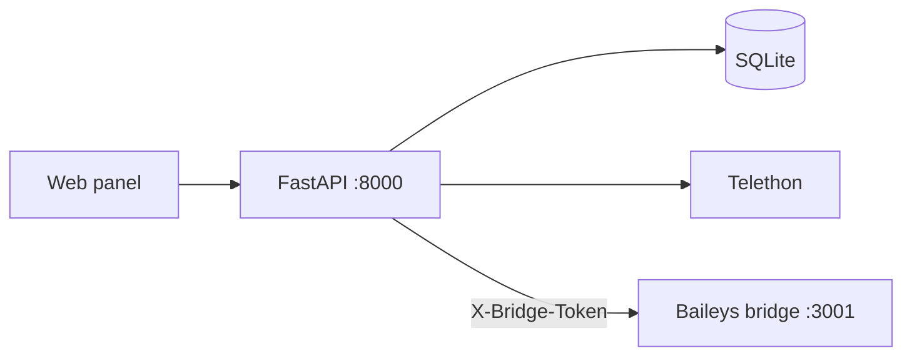

<p align="center">
  
</p>

<h1 align="center">Message Panel</h1>

<p align="center">
  <strong>Schedule Telegram &amp; WhatsApp messages from one self-hosted panel.</strong><br/>
  Unified inbox · recurring sends · REST API · webhooks · 15-language UI
</p>

<p align="center">
  <a href="https://github.com/bunyamindemir1/telegram-whatsapp-panel/actions/workflows/ci.yml"></a>
  <a href="src/LICENSE"></a>
  <a href="src/config/requirements.txt"></a>
  <a href="src/docs/I18N.md"></a>
  <a href="https://github.com/bunyamindemir1/telegram-whatsapp-panel/stargazers"></a>
</p>

<p align="center">
  <a href="#quick-start"><strong>Quick Start</strong></a> ·
  <a href="#why-message-panel">Why</a> ·
  <a href="#vs-native-apps">Comparison</a> ·
  <a href="#features">Features</a> ·
  <a href="#screenshots">Screenshots</a> ·
  <a href="src/docs/API.md">API</a> ·
  <a href="#turkce">🇹🇷 Türkçe</a>
</p>

<p align="center">
  
</p>

---

## Why Message Panel?

Phone apps are great for chatting — not for **operations**.

| Problem | Message Panel |
|---------|---------------|
| WhatsApp has **no send-later** on personal accounts | One-shot, recurring, and **random daily window** scheduling |
| Telegram & WhatsApp live in **separate apps** | **Unified inbox** — both platforms, one web UI |
| No **REST API / webhooks** on consumer accounts | Automate with API keys, webhooks, auto-replies, follow-ups |
| Cloud SaaS tools hold your data | **Self-hosted** — SQLite, encrypted credentials, your VPS |

> **Test mode by default** — outbound messages stay blocked until you set `ALLOW_OUTBOUND_MESSAGES=true` in `.env`.

---

## vs Native Apps

Personal accounts only — not Business API or bot-only setups. [Full comparison →](src/docs/COMPARISON.md)

| Capability | WhatsApp | Telegram | Message Panel |
|------------|:--------:|:--------:|:-------------:|
| Send later (one-shot) | ❌ | ⚠️ Limited | ✅ |
| Recurring / random daily window | ❌ | ❌ | ✅ |
| Unified inbox (TG + WA) | ❌ | ❌ | ✅ |
| REST API on personal account | ❌ | ❌ | ✅ |
| Webhooks | Business only | Bot only | ✅ |
| Auto-reply & follow-up rules | ❌ | ❌ | ✅ |
| Templates, tags, mute, snooze | ❌ | ❌ | ✅ |
| Backup / restore panel data | ❌ | ❌ | ✅ |
| Test mode (dry-run outbound) | ❌ | ❌ | ✅ |

---

<a id="features"></a>

## Features

<table>
<tr>
<td width="50%">

**Scheduling**
- One-shot, hourly, daily, weekly, custom interval
- Random daily send window
- Calendar view & job queue (pending / sent / failed)
- Message templates with variables

**Inbox & chats**
- Unified Telegram + WhatsApp threads
- Multi-account per platform
- Pin, mute, snooze, tags, notes
- Full-text message search

</td>
<td width="50%">

**Automation**
- REST API v1 + API keys
- Webhooks (`message.received`, `scheduled.sent`, …)
- Auto-reply (contains / exact / regex)
- Follow-up if no reply

**Ops & security**
- Docker one-command setup
- Bcrypt login, encrypted credential store
- Backup / restore · activity log
- **15-language UI** ([i18n docs](src/docs/I18N.md))

</td>
</tr>
</table>

**Stack:** FastAPI · Telethon · Baileys · SQLite · APScheduler · Docker

---

<a id="screenshots"></a>

## Screenshots

<p align="center">
  
  &nbsp;&nbsp;
  
  &nbsp;&nbsp;
  
</p>

<p align="center"><sub>Dashboard · Connect accounts · Login</sub></p>

---

<a id="quick-start"></a>

## Quick Start

**Requirements:** Docker 24+ with Compose v2

```bash
git clone https://github.com/bunyamindemir1/telegram-whatsapp-panel.git
cd telegram-whatsapp-panel
make setup
```

Open **http://127.0.0.1:8000** — sign in with the generated admin password, then connect **Telegram** (API credentials) or **WhatsApp** (QR scan).

<details>
<summary>Local development without Docker</summary>

```bash
make quick    # install dependencies and start
make test     # unit tests (150+)
make e2e      # Playwright smoke tests
```

Requires Python 3.9+ and Node.js 18+.

</details>

Full guide: **[src/docs/QUICKSTART.md](src/docs/QUICKSTART.md)**

---

## Languages & i18n

The **web panel** (not this README) ships with **15 languages**:

| Tier | Locales |
|------|---------|
| **Complete** | English, Turkish |
| **Community** | Arabic, German, Spanish, French, Italian, Japanese, Korean, Dutch, Polish, Portuguese, Russian, Ukrainian, Chinese |

Switch in the sidebar, via `?lang=de`, or browser `Accept-Language` on first visit.  
533 UI strings validated in CI. Details: **[src/docs/I18N.md](src/docs/I18N.md)**

---

## Architecture



| Component | Role |
|-----------|------|
| FastAPI panel | UI, scheduling, persistence, Telegram client |
| WhatsApp bridge | QR login, sync, send (isolated Node process) |
| APScheduler | Executes scheduled and recurring jobs |

Details: **[src/docs/ARCHITECTURE.md](src/docs/ARCHITECTURE.md)**

---

## Documentation

| Topic | File |
|-------|------|
| Architecture & data flow | [src/docs/ARCHITECTURE.md](src/docs/ARCHITECTURE.md) |
| Quick start & deployment | [src/docs/QUICKSTART.md](src/docs/QUICKSTART.md) |
| HTTP API | [src/docs/API.md](src/docs/API.md) |
| Feature comparison | [src/docs/COMPARISON.md](src/docs/COMPARISON.md) |
| Project layout | [src/docs/PROJECT_STRUCTURE.md](src/docs/PROJECT_STRUCTURE.md) |
| i18n (15 locales) | [src/docs/I18N.md](src/docs/I18N.md) |
| Contributing | [CONTRIBUTING.md](CONTRIBUTING.md) |
| Security | [SECURITY.md](SECURITY.md) |

---

## Development

```bash
cd src
pytest -q                 # unit tests
python scripts/validate_locales.py
make e2e                  # browser tests
```

CI runs tests, locale validation, and bridge syntax check on every push.

---

<a id="turkce"></a>

## 🇹🇷 Türkçe

<p align="center">
  <strong>Mesaj Paneli</strong> — kişisel Telegram ve WhatsApp hesaplarınız için self-hosted mesaj yönetim paneli
</p>

Telefondaki uygulamalarda olmayan özellikler tek panelde:

| Özellik | Açıklama |
|---------|----------|
| ⏰ Zamanlama | Tek seferlik, tekrarlayan, rastgele günlük pencere |
| 📥 Birleşik gelen kutusu | Telegram + WhatsApp aynı arayüzde |
| 🤖 Otomasyon | REST API, webhook, otomatik yanıt, takip hatırlatıcısı |
| 🌍 15 dil | Arayüz TR/EN tam · sidebar veya `?lang=tr` |
| 🔒 Veri sizde | SQLite, şifreli oturum · test modunda mesaj gitmez |

### Kurulum

```bash
git clone https://github.com/bunyamindemir1/telegram-whatsapp-panel.git
cd telegram-whatsapp-panel
make setup
```

Tarayıcı: **http://127.0.0.1:8000** — kurulum sonunda yazdırılan admin şifresi ile giriş yapın.

| Konu | Bağlantı |
|------|----------|
| Mimari | [src/docs/ARCHITECTURE.md](src/docs/ARCHITECTURE.md) |
| Kurulum rehberi | [src/docs/QUICKSTART.md](src/docs/QUICKSTART.md) |
| Native uygulama karşılaştırması | [src/docs/COMPARISON.md](src/docs/COMPARISON.md) |
| HTTP API | [src/docs/API.md](src/docs/API.md) |

---

<p align="center">
  <a href="https://star-history.com/#bunyamindemir1/telegram-whatsapp-panel&Date">
    <picture>
      <source media="(prefers-color-scheme: dark)" srcset="https://api.star-history.com/svg?repos=bunyamindemir1/telegram-whatsapp-panel&type=Date&theme=dark" />
      
    </picture>
  </a>
</p>

<details>
<summary>GitHub repo settings (SEO)</summary>

GitHub shows **one README for everyone** — no geo-targeting by country. English content above; Turkish at `#turkce`. The **panel app** adapts to the user's language.

Re-apply About description & topics after README changes:

```bash
./.github/apply-repo-seo.sh
```

Manual guide: **[.github/REPO_ABOUT.md](.github/REPO_ABOUT.md)**

</details>

---

## License

[MIT](src/LICENSE)
