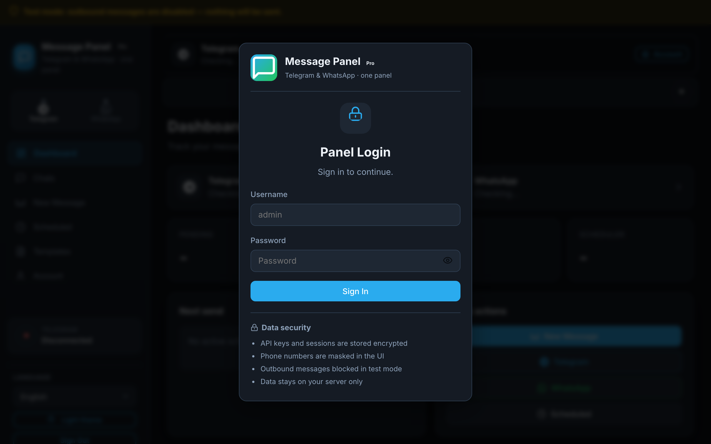
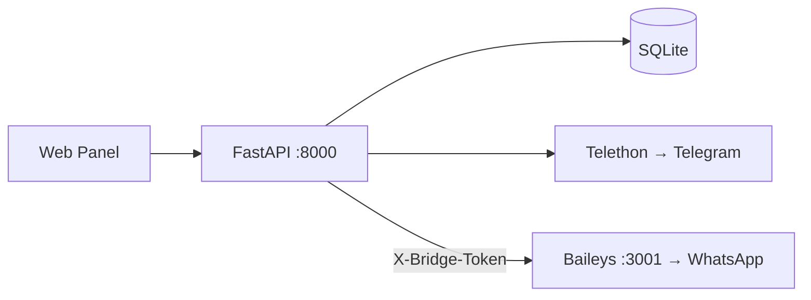

# Message Panel

> **Self-hosted unified inbox for Telegram & WhatsApp** — schedule messages, manage chats, REST API, webhooks, 15 languages. Runs on your server with one-command Docker setup.

[](https://github.com/bunyamindemir1/telegram-whatsapp-panel/actions/workflows/ci.yml)
[](LICENSE)
[](src/docs/QUICKSTART.md)
[](src/config/requirements.txt)
[](src/docs/I18N.md)

<p align="center">
  
</p>

<p align="center">
  <strong>One panel</strong> for your Telegram & WhatsApp accounts · <strong>Test mode</strong> by default · <strong>Your data</strong> stays on your server
</p>

<p align="center">
  <a href="#quick-start">Quick Start</a> ·
  <a href="#what-you-get">Features</a> ·
  <a href="#screenshots">Screenshots</a> ·
  <a href="src/docs/API.md">API</a> ·
  <a href="#türkçe">Türkçe</a>
</p>

---

## What is Message Panel?

Message Panel connects to **your own user accounts** (not bot-only APIs) and gives you a single web UI to:

- Read and send messages on **Telegram** and **WhatsApp**
- **Schedule** one-time or recurring sends (including random daily windows)
- Automate via **REST API** and **webhooks**
- Switch between **15 languages** (Arabic RTL supported)

Everything runs **self-hosted** — sessions, database, and credentials stay on your machine.

---

## What you get

| Area | What the panel provides |
|------|-------------------------|
| **Platforms** | Telegram (Telethon + API credentials) and WhatsApp (QR via Baileys) |
| **Inbox** | Unified chat list, thread view, reply, media attach, custom labels |
| **Scheduling** | Pending / sent / failed stats, next-send countdown, repeat rules |
| **Automation** | REST API v1, API keys, webhook events (`message.received`, `message.sent`) |
| **Security** | bcrypt login, encrypted credentials, test mode blocks outbound sends |
| **i18n** | EN, TR, AR, RU, DE, FR, ES, PT, IT, NL, PL, UK, ZH, JA, KO |
| **Deploy** | Docker Compose (`make setup`) or local dev (`make quick`) |

---

## Screenshots

Each screenshot maps to a real part of the UI.

### 1 · Secure login

<p align="center">
  
</p>

| # | UI element | What it means |
|---|------------|---------------|
| 1 | **Test mode banner** (top) | Outbound messages are blocked until you enable them in `.env` |
| 2 | **Brand + lock icon** | Panel authentication before any account access |
| 3 | **Sign in form** | bcrypt-protected admin login; password generated on first setup |
| 4 | **Data security list** | Encrypted API keys, masked phone numbers, self-hosted storage |

### 2 · First-run wizard

<p align="center">
  
</p>

| # | UI element | What it means |
|---|------------|---------------|
| 1 | **Step 1/2 badge** | Guided onboarding after first login |
| 2 | **Telegram card** | Connect with API ID/hash + phone verification |
| 3 | **WhatsApp card** | Connect by scanning a QR code with your phone |
| 4 | **Skip option** | Continue to dashboard and connect later |

### 3 · Dashboard

<p align="center">
  
</p>

| # | UI element | What it means |
|---|------------|---------------|
| 1 | **Sidebar** | Dashboard, Chats, New Message, Scheduled, Templates, Account |
| 2 | **Platform switcher** | Toggle Telegram / WhatsApp context for all tabs |
| 3 | **Connection cards** | Live Telegram & WhatsApp link status |
| 4 | **Scheduler stats** | Pending, sent, failed counts + next scheduled send |
| 5 | **Quick actions** | New message, open platform inbox, view scheduled queue |
| 6 | **Language selector** | 15-language UI (footer of sidebar) |

---

## Quick Start

**Requirements:** [Docker](https://docs.docker.com/get-docker/) 24+ with Compose v2

```bash
git clone https://github.com/bunyamindemir1/telegram-whatsapp-panel.git
cd telegram-whatsapp-panel
make setup
```

Open **http://localhost:8000** — the admin password is printed once (also saved to `.setup-credentials.txt`).

| Step | Action |
|------|--------|
| 1 | `make setup` creates `.env` and starts containers |
| 2 | Sign in with `admin` + generated password |
| 3 | **Wizard** — pick Telegram or WhatsApp and connect |
| 4 | Send, schedule, or call the REST API |

> First Docker build takes ~2–3 min. Later restarts: `make setup -- --fast` (~10 s).

<details>
<summary><strong>Local dev without Docker</strong></summary>

```bash
make quick                    # install + start
make smoke                    # health check
make stop
```

Requires Python 3.9+ and Node.js 18+.

</details>

---

## Architecture



| Component | Role |
|-----------|------|
| **Panel** (FastAPI) | UI, scheduling, Telegram, SQLite |
| **WhatsApp bridge** (Node/Baileys) | QR login, message sync, media |
| **Your server** | Sessions, DB, credentials — all local |

Full API reference: [src/docs/API.md](src/docs/API.md)

---

## Tech stack

| Layer | Technology |
|-------|------------|
| Backend | FastAPI, Telethon, APScheduler, SQLAlchemy |
| WhatsApp | Node.js, @whiskeysockets/baileys |
| Frontend | Vanilla JS, Lucide-style SVG icons |
| Database | SQLite |
| Deploy | Docker Compose or `make quick` |

---

## Project layout

```
telegram-whatsapp-panel/
├── README.md
├── LICENSE
├── Makefile
├── docker-compose.yml
└── src/                  ← all source code lives here
    ├── app/              FastAPI backend
    ├── config/           requirements, pytest
    ├── docker/           Dockerfile
    ├── docs/             guides & screenshots
    ├── locales/          15 languages
    ├── scripts/          setup, install, tools
    ├── tests/            pytest + E2E
    └── whatsapp-bridge/  Baileys service
```

Details: [src/docs/PROJECT_STRUCTURE.md](src/docs/PROJECT_STRUCTURE.md)

---

## Contributing

```bash
make test       # unit tests
make e2e        # browser tests
make preflight  # pre-publish checks
```

[src/docs/CONTRIBUTING.md](src/docs/CONTRIBUTING.md) · [src/docs/SUPPORT.md](src/docs/SUPPORT.md) · [src/docs/FAQ.md](src/docs/FAQ.md) · [src/docs/SECURITY.md](src/docs/SECURITY.md)

---

## License

[MIT](LICENSE) — Copyright (c) 2026 Message Panel Contributors

---

## Türkçe

**Mesaj Paneli** — Telegram ve WhatsApp hesaplarınızı tek panelden yöneten, self-hosted birleşik gelen kutusu ve mesaj zamanlayıcı.

### Kurulum

```bash
git clone https://github.com/bunyamindemir1/telegram-whatsapp-panel.git
cd telegram-whatsapp-panel
make setup
```

Tarayıcı: **http://127.0.0.1:8000** → giriş → hesap sihirbazı

### Öne çıkanlar

| Alan | Detay |
|------|--------|
| Platformlar | Telegram (Telethon) + WhatsApp (QR) |
| Mesajlaşma | Sohbet listesi, yanıt, şablonlar, medya |
| Zamanlama | Tek seferlik, tekrarlayan, rastgele günlük pencere |
| API | REST v1, API anahtarları, webhook |
| Dil | 15 dil, Arapça RTL |
| Güvenlik | Test modu varsayılan, şifreli kimlik bilgileri |

### Dokümantasyon

| Rehber | Link |
|--------|------|
| Hızlı başlangıç | [src/docs/QUICKSTART.md](src/docs/QUICKSTART.md) |
| API | [src/docs/API.md](src/docs/API.md) |
| Sunucu / HTTPS | [src/docs/SELF_HOSTING.md](src/docs/SELF_HOSTING.md) |
| SSS | [src/docs/FAQ.md](src/docs/FAQ.md) |

---

<!-- GitHub repo About (copy to Settings → General → Description):
Self-hosted unified inbox for Telegram & WhatsApp — schedule messages, REST API, webhooks, 15 languages. Docker one-command setup.
-->

<p align="center">
  <a href="https://github.com/bunyamindemir1/telegram-whatsapp-panel">github.com/bunyamindemir1/telegram-whatsapp-panel</a>
</p>
