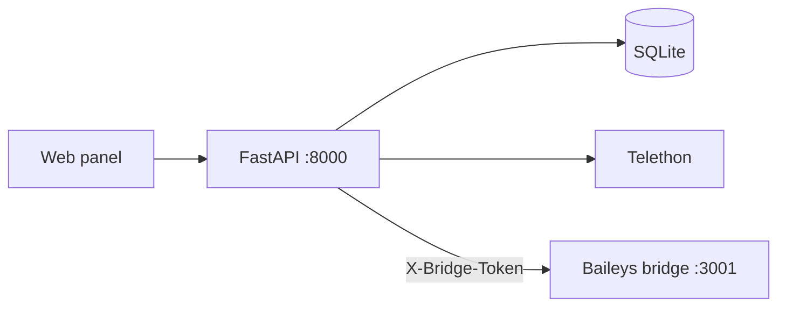

# Mesaj Paneli · Message Panel

Self-hosted messaging panel for **personal Telegram and WhatsApp accounts** — scheduling, unified inbox, templates, and REST API on your own server.

[](https://github.com/bunyamindemir1/telegram-whatsapp-panel/actions/workflows/ci.yml)
[](src/LICENSE)
[](src/config/requirements.txt)

<p align="center">
  
</p>

**Stack:** FastAPI · Telethon · Baileys · SQLite · APScheduler · vanilla JS

[Quick Start](#quick-start) · [Architecture](src/docs/ARCHITECTURE.md) · [API](src/docs/API.md) · [Comparison vs native apps](src/docs/COMPARISON.md) · [🇹🇷 Türkçe](#turkce)

---

## What it does

1. **Schedule messages** on Telegram and WhatsApp — one-shot, recurring, or random daily window (WhatsApp has no native scheduler).
2. **Manage both platforms** from one web UI: inbox, compose, templates, multi-account support.
3. **Automate** via REST API v1, API keys, and webhooks — without Business API or bot-only limits.

Data stays on your machine: SQLite database, Telegram sessions, encrypted API credentials. Test mode blocks outbound sends until you opt in via `.env`.

---

## Quick Start

**Requirements:** Docker 24+ with Compose v2

```bash
git clone https://github.com/bunyamindemir1/telegram-whatsapp-panel.git
cd telegram-whatsapp-panel
make setup
```

Open **http://127.0.0.1:8000** — sign in with the generated admin password, then connect Telegram (API credentials) or WhatsApp (QR).

<details>
<summary>Local development without Docker</summary>

```bash
make quick    # install dependencies and start
make test     # unit tests
make e2e      # Playwright smoke tests
```

Requires Python 3.9+ and Node.js 18+.

</details>

---

## Architecture



| Component | Role |
|-----------|------|
| FastAPI panel | UI, scheduling, persistence, Telegram client |
| WhatsApp bridge | QR login, sync, send (isolated Node process) |
| APScheduler | Executes scheduled and recurring jobs |

Design notes, auth model, message lifecycle, and data model: **[src/docs/ARCHITECTURE.md](src/docs/ARCHITECTURE.md)**

---

## Documentation

| Topic | File |
|-------|------|
| Architecture & data flow | [src/docs/ARCHITECTURE.md](src/docs/ARCHITECTURE.md) |
| Quick start & deployment | [src/docs/QUICKSTART.md](src/docs/QUICKSTART.md) |
| HTTP API | [src/docs/API.md](src/docs/API.md) |
| Feature comparison | [src/docs/COMPARISON.md](src/docs/COMPARISON.md) |
| Project layout | [src/docs/PROJECT_STRUCTURE.md](src/docs/PROJECT_STRUCTURE.md) |
| i18n | [src/docs/I18N.md](src/docs/I18N.md) |
| Contributing | [src/docs/CONTRIBUTING.md](src/docs/CONTRIBUTING.md) |
| Security | [src/docs/SECURITY.md](src/docs/SECURITY.md) |

---

## Development

```bash
cd src
pytest -q                 # unit tests (143+)
python scripts/validate_locales.py
make e2e                  # browser tests
```

Code layout: routes in `app/main.py` and `app/api_v1.py`, Pydantic models in `app/schemas/`, domain logic in `*_service.py` modules. CI runs tests, locale validation, and bridge syntax check on every push.

---

<a id="turkce"></a>

## 🇹🇷 Türkçe

**Mesaj Paneli**, kişisel Telegram ve WhatsApp hesaplarınız için self-hosted bir kontrol panelidir. Telefondaki uygulamalarda olmayan **zamanlanmış gönderim**, **tekrarlayan mesajlar**, **birleşik gelen kutusu** ve **REST API** sunar.

```bash
git clone https://github.com/bunyamindemir1/telegram-whatsapp-panel.git
cd telegram-whatsapp-panel
make setup
```

Tarayıcı: **http://127.0.0.1:8000**

| Konu | Bağlantı |
|------|----------|
| Mimari | [src/docs/ARCHITECTURE.md](src/docs/ARCHITECTURE.md) |
| Kurulum | [src/docs/QUICKSTART.md](src/docs/QUICKSTART.md) |
| Native karşılaştırma | [src/docs/COMPARISON.md](src/docs/COMPARISON.md) |
| API | [src/docs/API.md](src/docs/API.md) |

---

## License

[MIT](src/LICENSE)
