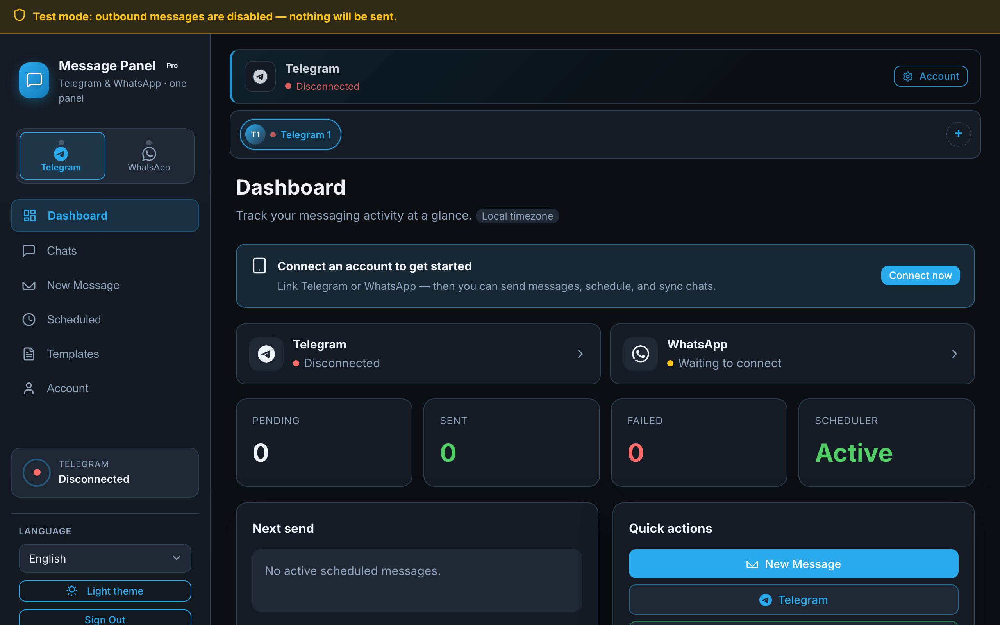
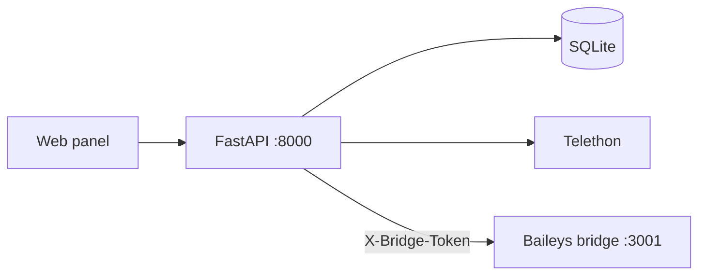

# Telegram & WhatsApp Message Scheduler · Mesaj Paneli

[](https://github.com/bunyamindemir1/telegram-whatsapp-panel/actions/workflows/ci.yml)
[](src/LICENSE)
[](src/config/requirements.txt)
[](src/docs/I18N.md)

**Self-hosted** messaging panel for **personal Telegram and WhatsApp accounts** — schedule messages, unified inbox, templates, auto-replies, REST API, and webhooks. **15-language UI** (EN/TR complete). Stack: **FastAPI · Telethon · Baileys · Docker**.

<p align="center">
  
</p>

[Quick Start](#quick-start) · [Languages](#languages--i18n) · [Architecture](src/docs/ARCHITECTURE.md) · [API](src/docs/API.md) · [Comparison](src/docs/COMPARISON.md) · [🇹🇷 Türkçe](#turkce)

---

## What it does

1. **Schedule messages** on Telegram and WhatsApp — one-shot, recurring, or random daily window (WhatsApp has no native scheduler).
2. **Manage both platforms** from one web UI: unified inbox, compose, templates, multi-account, mute/snooze, tags.
3. **Automate** via REST API v1, API keys, webhooks, auto-replies, and follow-up reminders — without Business API or bot-only limits.

Data stays on your machine: SQLite database, Telegram sessions, encrypted credentials. **Test mode** blocks outbound sends until you set `ALLOW_OUTBOUND_MESSAGES=true` in `.env`.

---

## Languages & i18n

The **web panel UI** (not this GitHub README) supports **15 languages**:

| Tier | Locales |
|------|---------|
| **Complete** | English, Turkish |
| **Community** | Arabic, German, Spanish, French, Italian, Japanese, Korean, Dutch, Polish, Portuguese, Russian, Ukrainian, Chinese |

- Switch language in the sidebar dropdown, via `?lang=de`, or browser `Accept-Language` on first visit
- API errors return i18n keys — the client translates them
- 533 UI strings validated in CI across all locale files

Details: **[src/docs/I18N.md](src/docs/I18N.md)**

> **GitHub vs panel:** GitHub shows **one README for everyone** (no geo-targeting by country). International visitors see the English sections above; Turkish readers can jump to [🇹🇷 Türkçe](#turkce). The **app itself** adapts to the user's language choice.

---

## Quick Start

**Requirements:** Docker 24+ with Compose v2

```bash
git clone https://github.com/bunyamindemir1/telegram-whatsapp-panel.git
cd telegram-whatsapp-panel
make setup
```

Open **http://127.0.0.1:8000** — sign in with the generated admin password, then connect Telegram (API credentials) or WhatsApp (QR).

<details>
<summary>Local development without Docker</summary>

```bash
make quick    # install dependencies and start
make test     # unit tests
make e2e      # Playwright smoke tests
```

Requires Python 3.9+ and Node.js 18+.

</details>

Full guide: **[src/docs/QUICKSTART.md](src/docs/QUICKSTART.md)**

---

## Architecture



| Component | Role |
|-----------|------|
| FastAPI panel | UI, scheduling, persistence, Telegram client |
| WhatsApp bridge | QR login, sync, send (isolated Node process) |
| APScheduler | Executes scheduled and recurring jobs |

Details: **[src/docs/ARCHITECTURE.md](src/docs/ARCHITECTURE.md)**

---

## Documentation

| Topic | File |
|-------|------|
| Architecture & data flow | [src/docs/ARCHITECTURE.md](src/docs/ARCHITECTURE.md) |
| Quick start & deployment | [src/docs/QUICKSTART.md](src/docs/QUICKSTART.md) |
| HTTP API | [src/docs/API.md](src/docs/API.md) |
| Feature comparison | [src/docs/COMPARISON.md](src/docs/COMPARISON.md) |
| Project layout | [src/docs/PROJECT_STRUCTURE.md](src/docs/PROJECT_STRUCTURE.md) |
| i18n (15 locales) | [src/docs/I18N.md](src/docs/I18N.md) |
| Contributing | [CONTRIBUTING.md](CONTRIBUTING.md) |
| Security | [SECURITY.md](SECURITY.md) |

---

## Development

```bash
cd src
pytest -q                 # unit tests (150+)
python scripts/validate_locales.py
make e2e                  # browser tests
```

CI runs tests, locale validation, and bridge syntax check on every push.

---

<a id="turkce"></a>

## 🇹🇷 Türkçe

**Mesaj Paneli**, kişisel **Telegram** ve **WhatsApp** hesaplarınız için self-hosted bir mesaj yönetim panelidir. Telefondaki uygulamalarda olmayan özellikler:

- **Zamanlanmış mesaj gönderimi** (tek seferlik, tekrarlayan, rastgele günlük pencere)
- **Birleşik gelen kutusu** — iki platform tek arayüzde
- **Otomatik yanıt**, takip hatırlatıcısı, şablonlar, etiketler
- **REST API**, API anahtarları ve webhook ile otomasyon
- **Çoklu hesap** desteği · **15 dil** arayüz (TR/EN tam)

Veriler sizin sunucunuzda kalır (SQLite, şifreli oturum). Test modunda mesaj gönderilmez.

### Kurulum (Docker)

```bash
git clone https://github.com/bunyamindemir1/telegram-whatsapp-panel.git
cd telegram-whatsapp-panel
make setup
```

Tarayıcı: **http://127.0.0.1:8000** — kurulum sonunda yazdırılan admin şifresi ile giriş yapın.

| Konu | Bağlantı |
|------|----------|
| Mimari | [src/docs/ARCHITECTURE.md](src/docs/ARCHITECTURE.md) |
| Kurulum rehberi | [src/docs/QUICKSTART.md](src/docs/QUICKSTART.md) |
| Native uygulama karşılaştırması | [src/docs/COMPARISON.md](src/docs/COMPARISON.md) |
| HTTP API | [src/docs/API.md](src/docs/API.md) |

---

<a id="github-repo-ayarlari-seo"></a>

## GitHub repo settings (SEO)

GitHub does **not** show different README text by country. For global discoverability:

| Setting | Recommended value |
|---------|-------------------|
| **Description** | English-first (see script below) |
| **Website** | Repo root (English README), not `#turkce` |
| **Topics** | Include `i18n` + stack tags |

Re-apply after README changes:

```bash
./.github/apply-repo-seo.sh
```

Manual guide: **[.github/REPO_ABOUT.md](.github/REPO_ABOUT.md)**

---

## License

[MIT](src/LICENSE)
