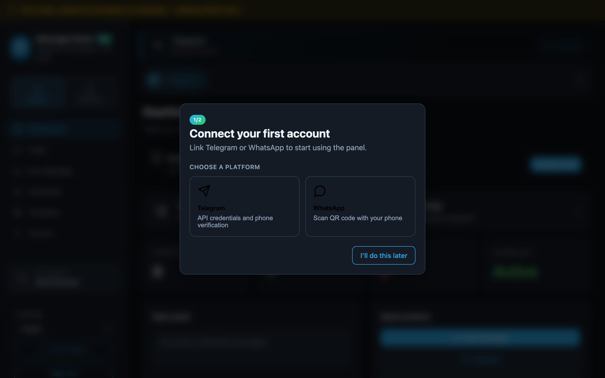
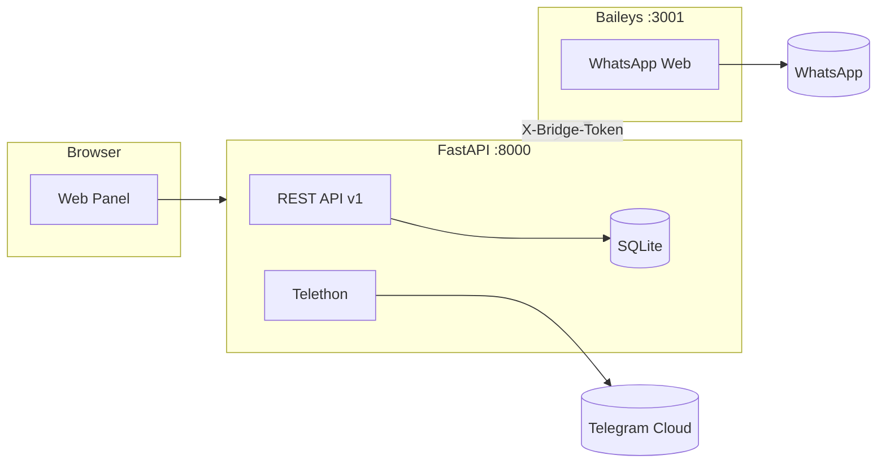

# Message Panel · Self-Hosted Telegram & WhatsApp Inbox

**Message Panel** (`telegram-whatsapp-panel`) is an open-source, **self-hosted unified inbox** for your own **Telegram** and **WhatsApp** accounts. Schedule messages, sync conversations, send media, and automate workflows with **REST API**, **webhooks**, and **15 languages** — all on your server.

> 🇹🇷 Turkish UI name: **Mesaj Paneli** · [Türkçe bölüm](#-türkçe--mesaj-paneli)

[](https://github.com/bunyamindemir1/telegram-whatsapp-panel/actions/workflows/ci.yml)
[](LICENSE)
[](docs/QUICKSTART.md)
[](requirements.txt)
[](app/main.py)
[](docs/I18N.md)
[](tests/)

<p align="center">
  <a href="https://github.com/bunyamindemir1/telegram-whatsapp-panel">
    
  </a>
</p>

<p align="center">
  <strong>Secure login</strong> · test mode by default · data stays on your server
</p>

<p align="center">
  <a href="#-quick-start-60-seconds">⚡ Quick Start</a> ·
  <a href="#-how-it-works">How it works</a> ·
  <a href="#-features">Features</a> ·
  <a href="docs/QUICKSTART.md">Docs</a> ·
  <a href="docs/API.md">API</a> ·
  <a href="#-türkçe--mesaj-paneli">Türkçe</a>
</p>

---

## Why Message Panel?

Use your **real user accounts** (not bot-only APIs) from one web panel:

| | Message Panel | Bot APIs | SaaS inbox tools |
|---|:---:|:---:|:---:|
| **Self-hosted** — your data | ✅ | ⚠️ | ❌ |
| Telegram **user** account | ✅ | ❌ | ⚠️ |
| WhatsApp via **QR** (your number) | ✅ | ❌ | 💰 |
| Message **scheduling** + media | ✅ | DIY | ✅ |
| REST **API** + **webhooks** | ✅ | ✅ | 💰 |
| **15 languages** + Arabic RTL | ✅ | rare | rare |
| **Safe test mode** (default) | ✅ | — | — |
| One-command **Docker** setup | ✅ | — | — |

**Keywords:** `telegram whatsapp panel`, `self-hosted messaging`, `unified inbox`, `message scheduler`, `telethon`, `baileys`, `fastapi`, `rest api`, `webhook automation`

---

## 📸 Screenshots

### Secure login & onboarding

<p align="center">
  
</p>

- **bcrypt** panel authentication
- **Test mode** banner — outbound messages blocked until you opt in
- Security checklist on login: encrypted credentials, masked phone numbers, self-hosted data

### Dashboard & unified inbox

<p align="center">
  
</p>

- Live **Telegram / WhatsApp** connection status
- **Pending / sent / failed** message stats
- **Next scheduled send** countdown
- Sidebar: Chats, New Message, Scheduled, Templates, API & Webhooks

### Feature overview

<p align="center">
  
</p>

---

## 🚀 Quick Start (60 seconds)

**Requirements:** [Docker](https://docs.docker.com/get-docker/) 24+ with Compose v2

```bash
git clone https://github.com/bunyamindemir1/telegram-whatsapp-panel.git
cd telegram-whatsapp-panel
chmod +x setup.sh && ./setup.sh
```

Open **http://localhost:8000** — admin password is printed once (also in `.setup-credentials.txt`).

| Step | What happens |
|------|----------------|
| **1** | `./setup.sh` generates secure `.env` and starts Docker containers |
| **2** | Log in with `admin` + generated password |
| **3** | **First-run wizard** — pick Telegram or WhatsApp |

<p align="center">
  
</p>

| **4** | Connect: Telegram API + phone code **or** WhatsApp QR scan |
| **5** | Send, schedule, or automate via API |

> First build ~2–3 min. Later: `./setup.sh --fast` (~10 s).

<details>
<summary><strong>Local dev without Docker (~30 s)</strong></summary>

```bash
./install.sh && ./start.sh    # or: make quick
./scripts/smoke_local.sh      # health + i18n check
./stop.sh
```

WhatsApp bridge starts automatically — no second terminal.

</details>

---

## 🧭 How it works



1. **Panel** (Python/FastAPI) — UI, scheduling, Telegram via Telethon, SQLite storage  
2. **WhatsApp bridge** (Node/Baileys) — QR login, message sync, media  
3. **Your server** — sessions, DB, and credentials stay local  

---

## ✨ Features

### 💬 Messaging

- Unified **chat list** for Telegram & WhatsApp  
- Send, reply, **templates**, custom **labels**  
- **Media** — photos, video, voice, documents (in & out)  
- **Multi-account** — several Telegram or WhatsApp numbers  

### ⏰ Scheduling

- One-time, hourly, daily, weekly repeats  
- **Random daily window** (e.g. 09:00–18:00 random send)  
- Turkey timezone UI (`Europe/Istanbul` default)  
- Scheduler dashboard with next-run countdown  

### 🔌 Automation

- **REST API v1** + OpenAPI at `/docs`  
- **API keys** (Bearer `mp_…`)  
- **Webhooks** — `message.received`, `message.sent`  
- Developer tab in panel UI  

### 🌍 UX & i18n

- **15 languages:** EN, TR, AR (RTL), RU, DE, FR, ES, PT, IT, NL, PL, UK, ZH, JA, KO  
- Dark / light theme  
- First-run **account wizard** + onboarding  
- Mobile-friendly layout  

### 🔒 Security

- **Test mode default** — `ALLOW_OUTBOUND_MESSAGES=false` (no accidental sends)  
- bcrypt panel auth, encrypted Telegram credentials  
- Bridge token (`X-Bridge-Token`), rate-limited login  
- Production rejects weak secrets · [SECURITY.md](SECURITY.md)  

---

## 📡 API example

```bash
# Send a message (after creating an API key in the panel)
curl -X POST http://localhost:8000/api/v1/messages/send \
  -H "Authorization: Bearer mp_YOUR_KEY" \
  -H "Content-Type: application/json" \
  -d '{
    "platform": "telegram",
    "account_id": 1,
    "chat_id": "123456789",
    "message": "Hello from Message Panel"
  }'
```

Full reference: [docs/API.md](docs/API.md)

---

## 🛠 Tech stack

| Layer | Technology |
|-------|------------|
| Backend | FastAPI, Telethon, APScheduler, SQLAlchemy |
| WhatsApp | Node.js, @whiskeysockets/baileys |
| Frontend | Vanilla JS, Lucide icons |
| Database | SQLite |
| Deploy | Docker Compose, optional local `install.sh` |

---

## 📁 Project structure

```
telegram-whatsapp-panel/
├── app/                 # FastAPI backend
├── whatsapp-bridge/     # Baileys Node service
├── templates/ static/   # Web UI
├── locales/             # 15-language translations
├── docs/                # Guides + screenshots
├── tests/               # 117+ pytest + Playwright E2E
├── setup.sh             # One-command Docker install
└── install.sh start.sh  # Fast local dev
```

Details: [docs/PROJECT_STRUCTURE.md](docs/PROJECT_STRUCTURE.md)

---

## 🤝 Contributing & support

- [CONTRIBUTING.md](CONTRIBUTING.md) — dev setup & PR flow  
- [SUPPORT.md](SUPPORT.md) — bugs & questions  
- [FAQ.md](docs/FAQ.md) — common issues  

```bash
make test          # unit tests
make e2e           # browser E2E
make preflight     # pre-publish checks
```

⭐ **Star the repo** if it helps you — it supports visibility on GitHub!

---

## 📄 License

[MIT](LICENSE) — free to use, modify, and distribute. Copyright (c) 2026 Message Panel Contributors.

---

## 🇹🇷 Türkçe · Mesaj Paneli

**Mesaj Paneli**, kendi Telegram ve WhatsApp hesaplarınızı tek panelden yönetmenizi sağlayan açık kaynak, self-hosted bir **birleşik gelen kutusu** ve **mesaj zamanlayıcıdır**.

<p align="center">
  
</p>

### Kurulum

```bash
git clone https://github.com/bunyamindemir1/telegram-whatsapp-panel.git
cd telegram-whatsapp-panel
chmod +x setup.sh && ./setup.sh
```

Tarayıcı: **http://127.0.0.1:8000** → giriş → **ilk hesap sihirbazı** (Telegram veya WhatsApp)

Yerel geliştirme: `./install.sh && ./start.sh` veya `make quick`

### Özellikler

| Alan | Detay |
|------|--------|
| Platformlar | Telegram (Telethon) + WhatsApp (QR) |
| Mesajlaşma | Anlık gönderim, şablonlar, etiketler, medya |
| Zamanlama | Tek seferlik, tekrarlayan, rastgele günlük pencere |
| API | REST v1, API anahtarları, webhook |
| Dil | 15 dil, Arapça RTL |
| Güvenlik | Test modu varsayılan, şifreli kimlik bilgileri |

### Dokümantasyon

| Rehber | Link |
|--------|------|
| Hızlı başlangıç | [docs/QUICKSTART.md](docs/QUICKSTART.md) |
| API | [docs/API.md](docs/API.md) |
| Sunucu / HTTPS | [docs/SELF_HOSTING.md](docs/SELF_HOSTING.md) |
| SSS | [docs/FAQ.md](docs/FAQ.md) |
| Türkçe indeks | [docs/tr/README.md](docs/tr/README.md) |

### Gereksinimler

- Docker (önerilen) veya Python 3.9+ + Node.js 18+  
- Telegram API: [my.telegram.org](https://my.telegram.org)  
- Kendi **kullanıcı hesabınız** — Bot API değil  

---

<p align="center">
  <a href="https://github.com/bunyamindemir1/telegram-whatsapp-panel">github.com/bunyamindemir1/telegram-whatsapp-panel</a>
  <br />
  <sub>Built for the global self-hosting community · MIT License</sub>
</p>
