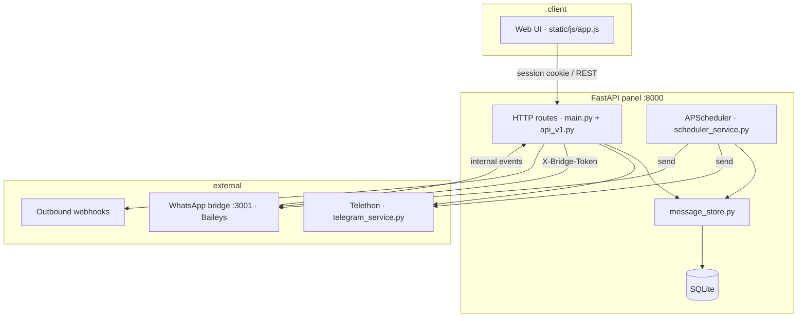

# Architecture

This document describes how Message Panel is structured, how data flows, and where responsibilities live. It is written for developers reviewing or extending the codebase.

## System overview

Message Panel is a **self-hosted control plane** for personal Telegram and WhatsApp accounts. It is not a hosted SaaS: the FastAPI app, SQLite database, Telegram sessions, and WhatsApp bridge all run on the operator's machine or VPS.

## Repository layout

| Path | Responsibility |
|------|----------------|
| `src/app/main.py` | Panel HTTP API, WebSocket, page render, bridge internal endpoints |
| `src/app/api_v1.py` | External REST API (`/api/v1/*`) with Bearer token auth |
| `src/app/schemas/` | Pydantic request models (panel API) |
| `src/app/models.py` | SQLAlchemy ORM models |
| `src/app/message_store.py` | Conversation/message persistence, search, metadata |
| `src/app/scheduler_service.py` | Scheduled job execution, repeat logic, job webhooks |
| `src/app/messaging.py` | Platform-agnostic send/list abstraction |
| `src/app/telegram_service.py` | Telethon client lifecycle, Telegram I/O |
| `src/app/whatsapp_service.py` | HTTP client to Node bridge |
| `src/whatsapp-bridge/` | Baileys process: QR auth, sync, send |
| `src/static/js/app.js` | Single-page panel UI (vanilla JS) |
| `src/locales/` | UI strings; `en.json` is the master key set |

Root contains only README, Makefile, and `.github/` so the GitHub landing page stays readable. All runtime code lives under `src/`.

## Authentication model

Three separate trust boundaries:

| Surface | Mechanism | Used by |
|---------|-----------|---------|
| Panel UI | Session cookie (`SessionMiddleware`, bcrypt login) | Browser |
| REST API v1 | Bearer token (`mp_…` API keys) | Scripts, n8n, integrations |
| Bridge internal | `X-Bridge-Token` header | WhatsApp bridge → panel |

Panel routes call `check_panel_auth`. API v1 routes use `require_v1_auth`. Bridge callbacks use `_check_bridge_auth`.

API errors return **stable i18n keys** from `error_codes.py` (e.g. `error.schedule.futureRequired`). The frontend resolves them via locale JSON; integrations can map keys to their own language.

## Multi-account scoping

Each platform supports multiple linked accounts (`platform_accounts` table). Messages and conversations are scoped by `(account_id, chat_id)` — not by platform alone.

Legacy rows without `account_id` are migrated to default accounts on startup (`database.assign_legacy_account_ids`).

When switching accounts in the UI, all list/send/schedule calls pass `account_id` so Telegram and WhatsApp data stay isolated.

## Message lifecycle

### Inbound (WhatsApp)

1. Baileys receives a message in the bridge.
2. Bridge POSTs to `/api/internal/event` with `type=message`.
3. Panel validates bridge token, resolves panel `account_id` from bridge id.
4. `message_store.save_message` upserts message + conversation row.
5. WebSocket broadcast to UI; webhook `message.received` if configured.
6. `auto_reply_service.try_auto_reply` may send a response.
7. Pending follow-up reminders for that chat are cancelled on inbound reply.

### Inbound (Telegram)

Telethon event handlers in `telegram_service.py` call the same `save_message` path.

### Outbound

1. UI or API calls `send_platform_message` / `send_platform_media`.
2. `outbound_guard` blocks real sends when test mode is active.
3. Platform adapter sends via Telethon or bridge HTTP.
4. Result persisted; webhook `message.sent` dispatched.

### Scheduled

1. Job created in `scheduled_messages` with `next_run_at`.
2. `scheduler_service.schedule_message` registers APScheduler job.
3. On fire: template variables rendered, message sent, status updated.
4. Repeating jobs compute next run (`compute_next_run`, random daily window).
5. Webhooks: `scheduled.sent` / `scheduled.failed`.

## WhatsApp bridge contract

The bridge is a separate Node process to isolate Baileys from the Python event loop.

| Direction | Endpoint | Notes |
|-----------|----------|-------|
| Panel → bridge | `/api/accounts/{id}/…` | QR, send, list chats |
| Bridge → panel | `/api/internal/event` | Real-time messages, connection status |
| Bridge → panel | `/api/internal/sync-whatsapp` | Bulk history import (paginated) |

All bridge → panel calls require `X-Bridge-Token` matching `BRIDGE_SECRET` in `.env`.

## Frontend architecture

Vanilla JS single-page app (`index.html` + `app.js`):

- Tab state: dashboard, chats, compose, scheduled, templates, account
- Platform context: `currentPlatform`, `account_id` on every API call
- i18n: `static/js/i18n.js` loads `/api/i18n/{locale}`; keys in `locales/*.json`
- Realtime: WebSocket `/ws` for new messages and connection updates
- Drafts: `localStorage` only (not synced server-side)

The UI intentionally avoids a frontend framework to keep deployment simple (no build step for the panel).

## Data model (core tables)

| Table | Purpose |
|-------|---------|
| `platform_accounts` | Linked Telegram/WhatsApp accounts |
| `conversations` | Inbox metadata: pin, notes, tags, mute, snooze |
| `chat_messages` | Message history, media refs, stars |
| `scheduled_messages` | Scheduler queue and repeat config |
| `message_templates` | Reusable snippets with categories |
| `auto_reply_rules` | Keyword/regex auto-responses |
| `follow_up_reminders` | No-reply reminder jobs |
| `api_keys` / `webhooks` | Automation surface |
| `activity_logs` | Panel audit trail |

SQLite with WAL mode. Migrations are incremental `ALTER TABLE` checks in `database._migrate()` — no Alembic; appropriate for single-node self-hosted scope.

## Testing strategy

| Layer | Tool | Scope |
|-------|------|-------|
| Unit / API | pytest + httpx AsyncClient | Routes, store, scheduler logic |
| i18n | `test_i18n.py` | Key parity; Turkish must differ from English |
| Packaging | `test_docker_packaging.py` | Dockerfile, compose, governance files |
| E2E | Playwright | Login, locale switch, smoke flows |
| Bridge | `node --check` in CI | Syntax only; behavioral tests planned |

Panel auth is disabled by default in unit tests via `conftest.py` except tests marked `@pytest.mark.panel_auth`.

## Design decisions (intentional)

- **SQLite over Postgres** — zero-config self-host; single operator, single node.
- **Separate bridge process** — Baileys stability and restart isolation.
- **Test mode default** — outbound blocked until `ALLOW_OUTBOUND_MESSAGES=true`.
- **i18n keys for API errors** — one contract for UI and API consumers.
- **Schemas split from routes** — `app/schemas/panel.py` keeps `main.py` focused on HTTP wiring.

## Further reading

- [API.md](API.md) — HTTP endpoints (Turkish)
- [PROJECT_STRUCTURE.md](PROJECT_STRUCTURE.md) — directory map
- [I18N.md](I18N.md) — translation workflow
- [COMPARISON.md](COMPARISON.md) — feature comparison vs native apps
